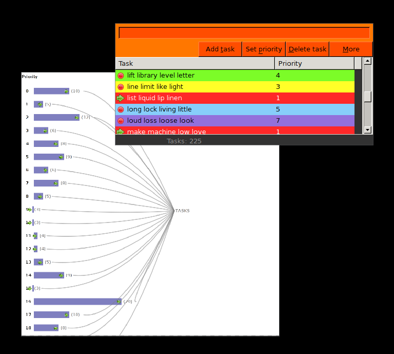

# Todo Application

This is what you get:

- Half-working features
- One huge hunkin' source file
- Commented out code everywhere
- Confusing file organization
- Confusing naming
- TODOs and FIXMEs in abundance
- HORRIBLE!

If you want modern, clean, maintainable and all-around sane code, look
someplace else.

-----------

Dependencies: `wx` and `cairo`

*Note:* The images in `res/images/` (`contact-new.png`, `go-next.png`, `media-record.png`, `process-stop.png`) are taken from the Tango icon theme (version 0.8.90).
